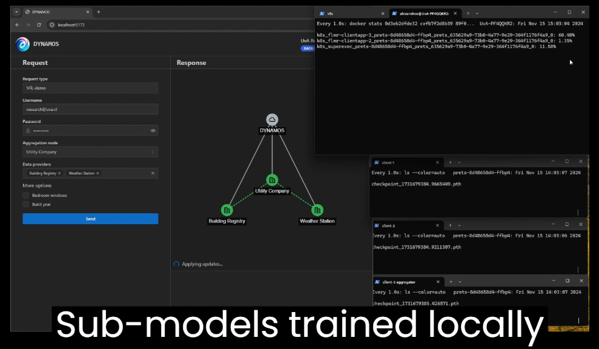
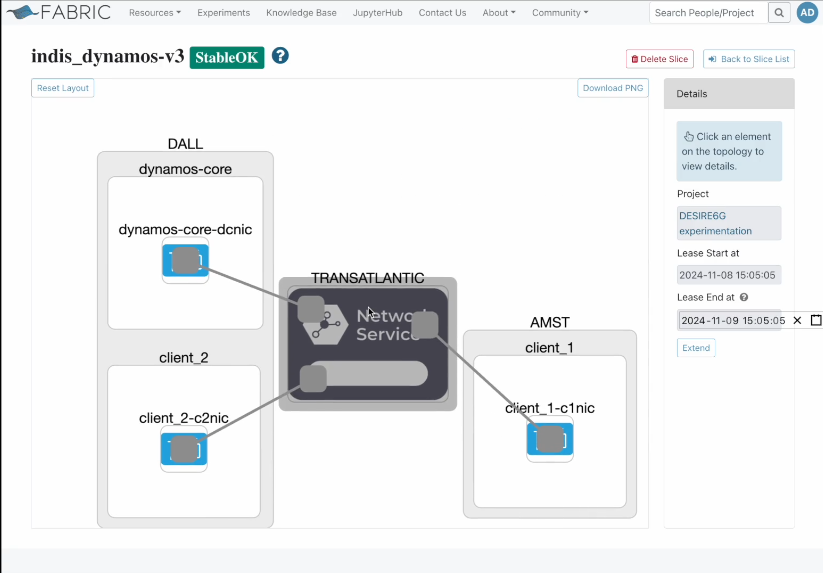

# Microservices-based FABRIC implementation of Collaborative Model Training Scenario  with Vertical Federated Learning at [SC24](https://delaat.net/sc/sc24/index.html)

The European Union Aviation Safety Agency (EASA) suggests that AI-driven algorithms, combined with fleet data, can detect engine failures early, enabling proactive maintenance and enhancing flight safety. The Independent Data Consortium for Aviation (IDCA) supports data sharing to improve these algorithms. However, issues like privacy, intellectual property, and regulations hinder this progress. Overcoming these challenges could lead to safer, more reliable air travel, benefiting society by reducing accidents and minimizing flight disruptions.

With this paper we demonstrate how a Federated Learning (FL)-based solution of collaborative model training could be deployed in a multi-tenant and multi-domain network, using microservices. The utilized DYNAMOS middle-ware, allows third-parties to maintain control of their data, privacy concerns are taken into account by design, and contractual agreements are enforced. We are proving our solution in a transatlantic slice (USA-NL) deployed in FABRIC, to simulate how airlines can exchange data and collaboratively train a model detecting engine failures.

[Video demo 1](https://delaat.net/sc/sc24/demo01/movie.mp4):

[Video demo 2](https://delaat.net/sc/sc24/demo02/movie.mp4):

INDIS [paper](./INDIS_2024_Short_Paper.pdf)
 
Presentation [slides](./5.3-sc24_indis_koufakis_dalgkitsis_v2.1.3.pdf)
 
<!-- Play the demo [video](https://github.com/DYNAMOS-UVA/.github/blob/main/Demonstration_material/SC_2023/SC2023_vid.mp4) -->

