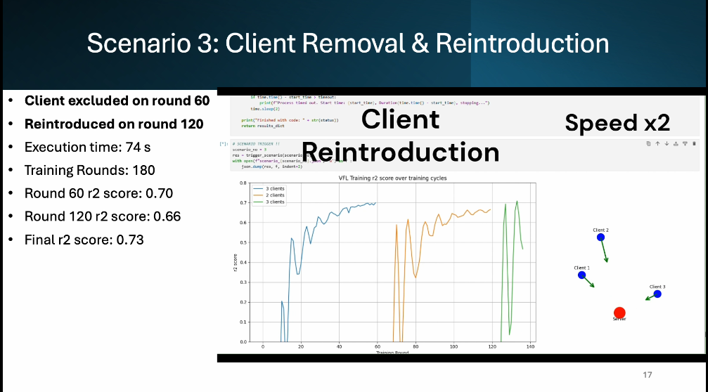

#  Policy-aware distributed Vertical Federated Learning infrastructure demo at [SC25](https://delaat.net/sc/sc25/index.html)

Harnessing the power of data is paramount to unlocking more effective applications, especially with the rise of machine learning. Data regulation, both through legislation and company policies, makes it impractical for different companies to learn from multiple datasets at once. Digital Data Marketplaces aim to solve this issue, by providing a platform where organizations can exchange data based on (dynamic) policies. The digital data marketplace enforces these policies, allowing only data exchange that does not violate policies.

In this work we demonstration how multiple geographically distributed companies can train a unified machine learning model collaboratively using Vertical Federated Learning. Towards this goal we designed and implemented Scattered Directive, a state-of-the-art distributed infrastructure deployment utilizing FABRIC, capable of automatically deploying a digital data marketplace platform. Moreover, we demonstrate the effect of dynamic data sharing policies and the impact on the universal model training.

[Video demo](https://delaat.net/sc/sc25/demo02/SC_2025_VFL_demo_Koufakis_w_vid.mp4):

Presentation [slides](./SC_2025_VFL_demo_Koufakis_no_vid.pdf)
 
[Paper]()
<!-- Play the demo [video](https://github.com/DYNAMOS-UVA/.github/blob/main/Demonstration_material/SC_2023/SC2023_vid.mp4) -->

